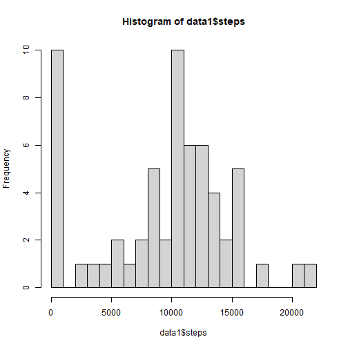
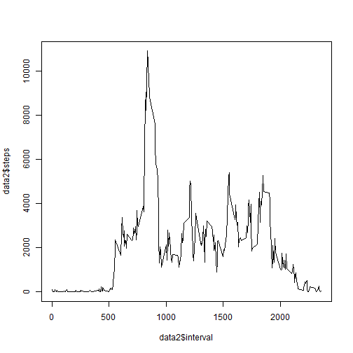
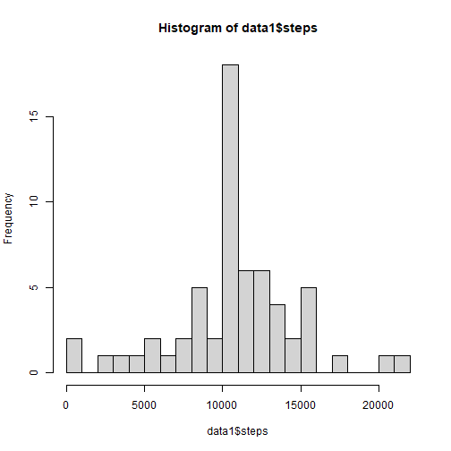
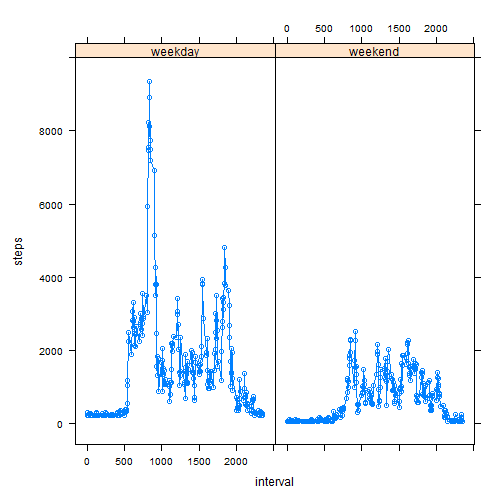

##Libraries

```r
library(dplyr)
library(lattice)
library(knitr)
```
## Loading and preprocessing the data

```r
unzip("activity.zip")
data <- read.csv("activity.csv")
```
## What is mean total number of steps taken per day?

```r
data1 <- data %>%
        group_by(date) %>%
        summarize(steps=sum(steps, na.rm=T))
hist(data1$steps, breaks = 20)
```



```r
mean <- mean(data1$steps)
median <- median(data1$steps)
```
The mean is 9354 and the median is 1.0395 &times; 10<sup>4</sup>.

## What is the average daily activity pattern?

```r
data2 <- data %>% 
        group_by(interval) %>% 
        summarize(steps=sum(steps, na.rm=T))
plot(data2$interval, data2$steps, type="l")
```



```r
max <- data2$interval[which.max(data2$steps)]
```
The 835 5-minute interval contains the maximum number of steps.

## Imputing missing values

```r
sum_NA <- sum(is.na(data)) 

data_without_na <- data

data_without_na$steps[which(is.na(data$steps))] <- mean(data$steps, na.rm=T)# NA is equal to mean of steps

data1 <- data_without_na %>%
        group_by(date) %>%
        summarize(steps=sum(steps, na.rm=T))

hist(data1$steps, breaks = 20)
```



```r
mean <- mean(data1$steps)
median <- median(data1$steps)
```
The mean is 1.0766 &times; 10<sup>4</sup> and the median is 1.0766 &times; 10<sup>4</sup>.
The histogram of data with imputing missing values is more pointed in the middle and does not have a high bar with steps near 0. Imputing missing data slightly increased the mean and median.

## Are there differences in activity patterns between weekdays and weekends?

```r
week <- weekdays(as.Date(data_without_na$date))
for(i in 1:length(week)){
        ifelse(week[i] %in% c("субота", "неділя"), week[i] <- "weekend", week[i] <- "weekday")
}
week <- factor(week)
data_without_na$week <- week
data1 <- data_without_na %>%
        group_by(interval, week) %>%
        summarize(steps=sum(steps, na.rm=T))
```

```
## `summarise()` has grouped output by
## 'interval'. You can override using the
## `.groups` argument.
```

```r
xyplot(steps ~ interval|week, data=data1, type="b")
```


